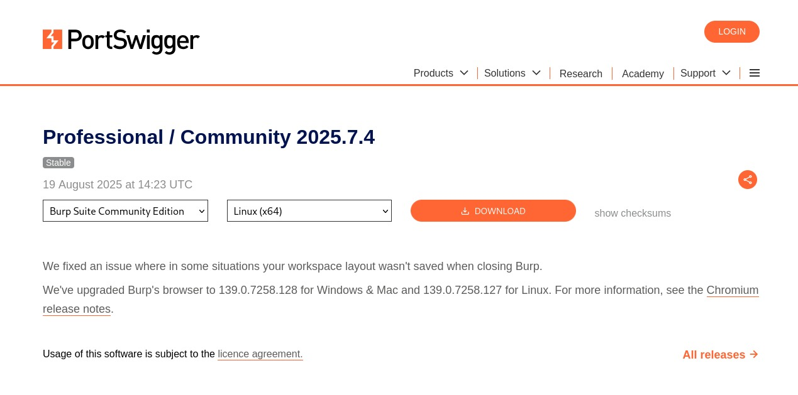
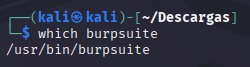

# Práctico 1

A continuación se describiran los pasos para instalar los siguientes elementos:

- una máquina virtual
- Proxy de interceptación BURP
- Visual Studio Code
- Docker 

Luego se describirán los pasos necesarios para ejecutar Ejecución de *OWASP* y *Crappi* en un ambiente Dockerizado.

## Instalación de la máquina virtual

Para instalar la máquina virtual se utilizó la herramienta VirtualBox y se utilizó Kali Linux como sistema operativo. 
Antes de realizar las instalación de la máquina virtual, primero es necesario tener descargado el software de VirtualBox y la imágen ISO de Kali Linux. En este procedimiento se tuvo como referencia la siguiente guía de la documentación oficial de Kali ([Ver enlace](https://www.kali.org/docs/virtualization/install-virtualbox-guest-vm/)).

### Configuración de la máquina virtual

Una vez habiendo instalado VirtualBox y la ISO de kali, abra virtual box y se mostrará la siguiente pantalla:
   
   
   
Para configurar la máquina virtual Siga los siguientes pasos:

1. Presione en "New" para agregar una nueva máquina virtual y complete los datos requeridos, seleccionando el nombre de la máquina, directorio, sistema operativo, de la siguiente forma:
   
   
   
2. Ajuste la memoria y nucleos de procesamiento
3. Finalice el proceso y cree la máquina
4. Le aparecerá la máquina creada en el inicio

### Instalación de Kali Linux

Inicialice la máquina virtual recién configurada presionando en "Start". Se prenderá la máquina y se comenzará la instalación del sistema operativo. Para tener una mejor experiencia de software, seleccione la opción de "Graphical install" para realizar el proceso con una interfaz gráfica y no por consola. 

Una vez comenzado el proceso, siga los siguientes pasos:

1. Seleccione idioma y ubicación
2. Configure el teclado
3. Configurar la red
   1. Configurar nombre de la máquina
   2. Configurar nombre de dominio (este paso se puede omitir)
4. Crear usuario y contraseña
5. Particionado de disco:
   1. Seleccionar la opción de utilizar todo el disco
   2. Seleccionar esquema de "Todos los ficheros en una partición"
   3. Confirmar y finalizar el particionado
7. Seleccionar programas y finalizar

Luego de seguir estos pasos, se instalará el sistema operativo y se iniciará la máquina. Esto demorará unos minutos. 

## Instalación de BURP

A continuación se mostrarán los pasos para instalar el proxy de intercepción BURP. Para realizar la instalación, primero se debe descargar la imagen para Linux en el sitio oficial ([Ver enlace](https://portswigger.net/burp/communitydownload)). 

Una vez ingresado su correo electrónico debería aparecer la siguiente pantalla:



Presione descargar y siga los siguientes pasos:

1. Dirigirse a la carpeta donde se encuentra el archivo descargado. El archivo que se descarga tiene formato .sh 
el cual contiene los comandos necesarios para comenzar la instalación. 
2. Luego ortorgar los permisos necesarios para ejecutar el archivo con el comando: 
   ```
   chmod +x burpsuite_community_linux_v2025_7_4.sh
   ```
3. Ejecutar el archivo para comenzar la instalación
   ```
   ./chmod +x burpsuite_community_linux_v2025_7_4.sh
   ```
4. Verificar si se instaló correctamente 
   ```
   which burpsuite
   ```

   Debería de devolver el siguiente mensaje el cual contiene la ruta del ejecutable.

   
5. Para ejecutar la aplicación puede utilizar el comando `burpsuite` o abrirla con la interfaz de usuario. 

## Instalación de Visual Studio Code

Para instalar Visual Studio Code en la máquina virtual, dirijase a la página oficial de Visual Studio Code a través del siguiente [enlace](https://code.visualstudio.com/docs/setup/linux#_install-vs-code-on-linux). 
